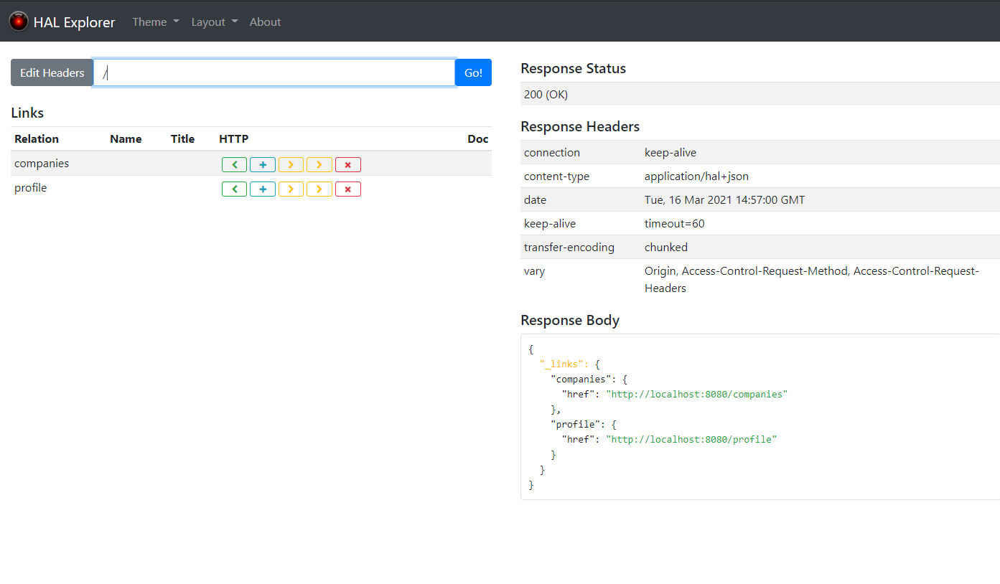

#Provider Service
## Introduction
This API is a RestFull-Service build with Spring-Boot and JPA. It provides endpoint to manage the base data for a company.
The base data includes:
- <span style="color:#c9d200">**companyId**</span> unique identifier of the company
- <span style="color:#c9d200">**ownerId**</span> unique identifier of the user, who crated the entry
- <span style="color:#c9d200">**name**</span> of company
- <span style="color:#c9d200">**city**</span> where the company resides
- <span style="color:#c9d200">**country**</span> where the company resides
- freetext to describe what the company does (<span style="color:#c9d200">**profile**</span>)
- <span style="color:#c9d200">**logoUrl**</span> url to an logo

To Upload a logo the **Logo-Service-API** can be used.
## Features


## Security
Every User can read the profiles of all companies
Creating a new profile is only allowed for registered users and logged in users.
Only the user who has created the profile can update or delete it.

The API will use Auth0 for user management and token verification.
### configuration
the following envelope vars are necessary to set up security:
> todo: add enc-vars here

##endpoints
The endpoint are accessible from the `[base-url]/api`
### getAllCompanies
GET: `[base-url]/api/companies{?page,size,sort}`
this endpoint supports paging and sorting with optional url-parameters
with 
- page = requestes page number (default=0)
- size = number of records to return (default =20)
- sort = field for sorting (see [Introduction](#Introduction))

### Get 1 Company
GET: `[base-url]/api/companies/{Id_Company}`

### Add a new company
POST `[base-url]/api/companies/`
with a json payload in the body
```json
{
  "name": "[name of the comapany]",
  "city": "[city of residence]",
  "country": "[country of residence]",
  "profile": "[freetext to describe what the company does]",
  "logoUrl": "[optional path to the logo of the company]"    
}
```
##Building the Backend
### Prerequisites
####Java Version
to build the jar JAVA Version 11 necessary
make sure that JAVA_HOME points to the correct jdk-version
you may set your JAVA_HOME with the following commands

**Windows** = `SET JAVA_HOME=[directory] `

**UNIX**= `EXPORT JAVA_HOME=[directory]` or `$ sudo update-alternatives --config java`
#### Docker
You need Docker on yout machine to create an image
see https://www.docker.com/get-started

### Build executable jar
if java 11 is defined by the environment variable you simple run
`mvn install`
This creates a jar-File in the target -Folder

### Build Docker Image
`mvnw spring-boot:build-image`

You can check the image with `docker images`
The image should be something like `prepo:[version]`

Run the image with `docker run -p 8080:8080 prepo:0.0.1-SNAPSHOT` 
(where 0.0.1-SNAPSHOT is the version)

After you successfully started the image you can access the HAL-Explorer on http://localhost:8080

